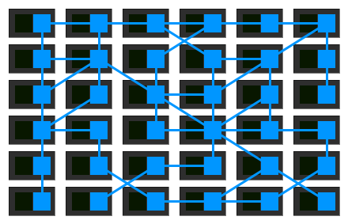

# 微服务治理：Kubernetes + Istio（二）

### 简介

本次分享主要回顾k8s部分知识点，介绍了ServiceMesh，Istio相关概念，重点介绍istio的流量管理的原理与实操。

### 上期回顾与补充

**Kubernetes的功能概述**

K8s提供了平台基础设施层强大的容器编排能力和调度能力（状态机+自动扩缩容），实现了服务部署扩缩容以及服务发现等功能，同时基于iptables或IPVS提供了简单的负载均衡

**Kubernetes网络模型**

访问业务的方式：

- 客户端直接访问podIP

  

  - 节点0上维护路由表，访问172.30.76.0/8私有网段的请求全部交给overlay network处理
  - overlay network中维护了不同节点中内网IP与本机MAC地址的关系

- 客户端通过虚拟IP访问（服务发现）

  

  - Node0主机上的IPTables规定，访问10.254.116.224的流量将会重定向到172.30.76.7或者172.30.9.2这两个IP
  - 接下来的跨节点访问过程同上

### Service Mesh

服务网格的中心思想，是为每一个业务服务分配一个专用的网关（边车网关Sidecar），服务治理系统向该网关下发服务发现信息以及控制信息，用于处理服务之间的通信。

​                                        

中间件团队负责维护这套服务治理的分布式架构，业务团队专注于开发业务

#### Istio

Istio是服务网格（service mesh）的一个工程实践，它最大的特点是弥补了k8s在服务治理方面的不足，包括流量细粒度管理，监控，速率限制以及身份验证和授权的安全控制等能力。

#### 架构

 

#### 主要组件

- **Proxy：**拦截进出服务的流量

- **Pilot：**配置流量管理规则写入Proxy
- Mixer: 监控，遥测
- Gally: 配置验证
- Citadel: 安全

**Istio流量模型:**

- 与传统K8S部署POD的流程不同，采用istio方式部署POD，需要进行进行sidecar注入
  - 第一步部署PAUSE容器，创建虚拟网卡用于初始化整个POD网络环境
  - 第二部启动ini-container，给该POD所在主机配置iptables规则，劫持流量重定向（关键）
  - 启动业务容器和proxy容器

- 如何实现细粒度的路由管理，流量管理？
  - VirtualService(虚拟服务)
    - 是对k8s的Service的延申，对Service下绑定的POD做了分组管理以及路由定制
  - DestinationRule(目标规则)
    - 制定了请求到达该分组的具体访问策略（随机分配，最少连接，轮询，熔断等等）
  - Gateway(网关)
    - 接入Istio之后，访问服务的统一入口

