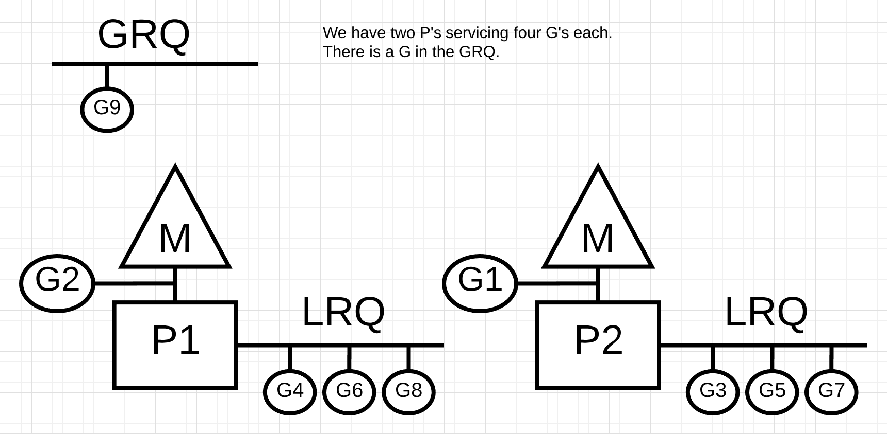

# sync.pool

#### What？

简单说pool是一个临时对象的集合

#### Why？

GO语言可以自动垃圾回收，垃圾回收给编程带来便利，但在高性能的场景下，过多的垃圾导致GC负担过，重会对程序本身带来不良影响。

sync.pool设计就是用于保存以及复用临时对象，从而增加对象的复用率，以减少内存的分配，降低GC压力。

### How?

- Demo演示

- 前备知识: Golang并发原理

  **GPM模型**

  

  - G（groutine）：语言层面创建的协程（用户级线程）

  - M（Machine）：内核线程

  - P（Processor）：调度器，分配Groutine到真正的内核线程去运行

    

- 源码分析

  - Pool

    Pool是对象池的基础数据结构

    

    ```go
    type Pool struct {
        // 防止当前类型被copy，因为一个类型的对象池只需要一个pool
    	noCopy noCopy
    	// poolLocal数组的指针
    	local     unsafe.Pointer 
        // poolLocal数组的大小，原则上与P大小相等，默认是runtime.GOMAXPROCS(0)的大小
        localSize uintptr        
    	// 用户自定义构造函数，创建新的临时对象
    	New func() interface{}
    }
    
    type poolLocal struct {
    	// 每个P对应的pool
    	poolLocalInternal
    	// 用于防止伪共享
    	pad [128 - unsafe.Sizeof(poolLocalInternal{})%128]byte
    }
    
    type poolLocalInternal struct {
        // 私有对象
    	private interface{}   
    	// 共享对象列表
    	shared  []interface{} 
    
    	Mutex               
    }
    ```

    

  

  

  - 整体架构

    

  - Put

    整体流程：

    1. 检查P数量与local数组大小是否合法
    2. 设置当前P禁止抢占，并关联一个poolLocal
    3. 优先将临时对象放入private，已满则加入share列表

    ```go
    func (p *Pool) Put(x interface{}) {
    	if x == nil {
    		return
    	}
        // 将一个poolLocal绑定到P
    	l := p.pin()
    	if l.private == nil {
    		l.private = x
    		x = nil
    	}
    	runtime_procUnpin()
        // share需要加锁，因为share列表中的临时对象可以被其他P访问
        // private不需要加锁，因为它时被当前的P独享，不存在并发访问的问题
    	if x != nil {
    		l.Lock()
    		l.shared = append(l.shared, x)
    		l.Unlock()
    	}
    }
    
    func (p *Pool) pin() *poolLocal {
        // 获取当前协程所在的P的id， 并设置禁止抢占
    	pid := runtime_procPin()
    	s := atomic.LoadUintptr(&p.localSize) 
    	l := p.local   
        // 默认情况下pid小于local数组大小，以下两种情况会导致pid < s
        // p本身未初始化
        // - 程序运行过程中可能会动态调整P的个数
    	if uintptr(pid) < s {
            // 获取具体的poolLocal
    		return indexLocal(l, pid)
    	}
    	return p.pinSlow()
    }
    
    func (p *Pool) pinSlow() *poolLocal {
    	// 取消禁止抢占
    	runtime_procUnpin()
    	allPoolsMu.Lock()
    	defer allPoolsMu.Unlock()
    	pid := runtime_procPin()
    	// poolCleanup won't be called while we are pinned.
    	s := p.localSize
    	l := p.local
        // 再次检查pid是否符合条件
        // 因为之前设置了取消抢占，因此当前的Groutine可能已经被调度到了其他的P上
    	if uintptr(pid) < s {
    		return indexLocal(l, pid)
    	}
        // local为空，表征这是一个全新的pool，尚未初始化
        // 将其加入全局的allPool列表（GC时会用到这个对象）
    	if p.local == nil {
    		allPools = append(allPools, p)
    	}
    	// 保证local数组的大小与当前P的数量一致.
    	size := runtime.GOMAXPROCS(0)
    	local := make([]poolLocal, size)
    	atomic.StorePointer(&p.local, unsafe.Pointer(&local[0])) 
    	atomic.StoreUintptr(&p.localSize, uintptr(size))        
    	return &local[pid]
    }
    ```

  - Get

    整体流程：

    1. 设置禁止抢占，将当前P关联一个poolLocal对象
    2. 优先从该poolLocal的private获取临时对象，若无则去share对象列表获取
    3. 上述两种方式都无法获取，则从其他P关联的poolLocal对象的share列表偷一个
    4. 连偷都偷不到，只好调用用户注册的New方法创建一个

    ```go
    func (p *Pool) Get() interface{} {
    	l := p.pin()
    	x := l.private
    	l.private = nil
    	runtime_procUnpin()
    	if x == nil {
    		l.Lock()
    		last := len(l.shared) - 1
    		if last >= 0 {
    			x = l.shared[last]
    			l.shared = l.shared[:last]
    		}
    		l.Unlock()
    		if x == nil {
    			x = p.getSlow()
    		}
    	}
    	if x == nil && p.New != nil {
    		x = p.New()
    	}
    	return x
    }
    
    func (p *Pool) getSlow() (x interface{}) {
    	size := atomic.LoadUintptr(&p.localSize) 
    	local := p.local                         
    	// Try to steal one element from other procs.
    	pid := runtime_procPin()
    	runtime_procUnpin()
    	for i := 0; i < int(size); i++ {
            // 这里遍历时采用了取模的技巧，目的是优先去其他P找找看有没有可用的临时对象
            // 别人那儿找不不到才会不死心的再瞅瞅自己有了没。
    		l := indexLocal(local, (pid+i+1)%int(size))
    		l.Lock()
    		last := len(l.shared) - 1
    		if last >= 0 {
    			x = l.shared[last]
    			l.shared = l.shared[:last]
    			l.Unlock()
    			break
    		}
    		l.Unlock()
    	}
    	return x
    }
    
    ```

  - poolCleanup

    ```go
    func poolCleanup() {
    	// This function is called with the world stopped, at the beginning of a garbage collection.
    	// It must not allocate and probably should not call any runtime functions.
    	// Defensively zero out everything, 2 reasons:
    	// 1. To prevent false retention of whole Pools.
    	// 2. If GC happens while a goroutine works with l.shared in Put/Get,
    	//    it will retain whole Pool. So next cycle memory consumption would be doubled.
    	for i, p := range allPools {
    		allPools[i] = nil
    		for i := 0; i < int(p.localSize); i++ {
    			l := indexLocal(p.local, i)
    			l.private = nil
    			for j := range l.shared {
    				l.shared[j] = nil
    			}
    			l.shared = nil
    		}
    		p.local = nil
    		p.localSize = 0
    	}
    	allPools = []*Pool{}
    }
    ```

- 实际应用

  - zap包
    - entry.go: 
      - 自己实现了对Put， Get的封装，支持了对临时对象的reset
      - 对获取到的临时对象进行是否未脏数据判断，避免前人使用过的临时对象中的数据影响本次使用，增强了程序健壮性。

